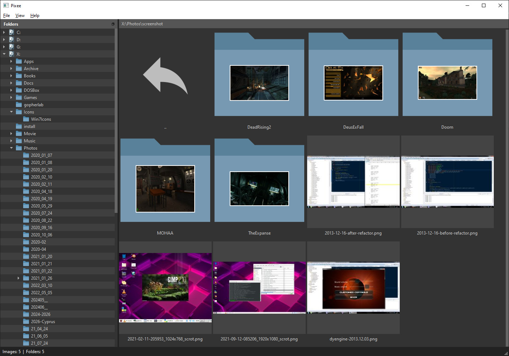

<h1 align="center">📷 Pixee</h1>

<p align="center">A responsive, minimalist image manager built on Qt 6.</p>

<p align="center">
  
  
  
  
</p>



## ✨ Features

- **Folder browsing** with multi-drive root, async directory enumeration off the GUI thread, and `..` always sorted first.
- **Thumbnail pipeline** — local SQLite cache, four-worker decode pool, viewport-driven priority queue (top-left → bottom-right), per-session negative caching, automatic background fill of the rest of the folder once the visible items are done.
- **Folder index thumbnails** — the alphabetically-first image inside each folder is auto-picked and overlaid on the folder icon, with a configurable margin / border / vertical offset.
- **Image viewer** integrated into the main window: async chunked loading with a cached-thumbnail placeholder, fit / 1:1 / discrete zoom (`0.1×` – `8×`), pan with `Space + LMB` or `Middle-drag`, 90° rotate, `F11` fullscreen, plus a 5-image preload cache for instant prev/next.
- **Format support** for everything Qt's image plugins can decode — JPEG, PNG, WebP, GIF, BMP, ICO, plus whatever extra plugins (HEIC, AVIF, PSD via [`kimageformats`](https://invent.kde.org/frameworks/kimageformats), …) are installed against your Qt build. ICO files pick the highest-area, highest-bit-depth sub-image.
- **Pixel-art aware** — nearest-neighbor upscaling for source images smaller than the cell, smooth scaling for downscaling. Transparent images render over a configurable checker pattern.
- **SMB-friendly** — chunked file reads with cooperative abort, off-GUI directory enumeration, no `QFileSystemModel` / `QFileDialog` for browsing. Designed for image folders sitting on a network share.
- **Themable** — Qt stylesheet (`style.qss`) plus an INI for non-CSS values (`style.ini`). User overrides drop in at `~/.pixee/themes/<name>/`. Dark theme included.

## 🛠️ Building

### Debian 13 (Trixie)

```sh
sudo apt install build-essential qt6-base-dev qt6-base-dev-tools qt6-l10n-tools
qmake6 Pixee.pro
make
./Pixee
```

### Other platforms

With Qt 6.6+ and qmake installed:

```sh
qmake Pixee.pro
make            # nmake / mingw32-make on Windows
./Pixee
```

The build copies the `themes/` directory next to the executable on every build, so the dark theme works out of the box.

## ⌨️ Keyboard

### File browser

| Shortcut | Action |
|---|---|
| `F5` | Refresh current folder |
| `F11` | Toggle fullscreen |
| `Enter` / Double-click | Open folder or image |
| `Ctrl + Q` | Quit |

### Image viewer

| Shortcut | Action |
|---|---|
| `←` / `→` | Previous / next image |
| Mouse wheel | Previous / next image |
| `Ctrl` + Mouse wheel | Zoom in / out |
| `+` / `-` | Zoom in / out |
| `0` / `*` | Toggle fit to window |
| `1` | Actual size (1:1) |
| `Space` + Left-drag | Pan |
| Middle-drag | Pan |
| `F11` | Toggle fullscreen |
| `Esc` / `Enter` / Double-click | Return to the file list |
| Right-click | Context menu — rotate left / right, **Copy to…** |

## 🎨 Theming

Each theme is a folder under `themes/`:

```
themes/dark/
├── icons/         # back / file / folder / image-* placeholders
├── images/        # branch arrows etc.
├── style.qss      # Qt stylesheet
└── style.ini      # extra colours / sizes (checker pattern, index-thumbnail margin, ...)
```

Drop a folder at `~/.pixee/themes/<name>/` to override the bundled assets without rebuilding. Anything missing from the user theme falls through to the embedded defaults.

## 🏗️ Architecture

- **Threads** — GUI for view & model; dedicated workers for the SQLite thumbnail cache, four parallel thumbnail decoders, directory enumeration, and full-res viewer loads. Cross-thread communication is exclusively via Qt signals/slots with queued connections.
- **Cache** — `~/.pixee/thumbnails.s3db` (SQLite, WAL). Path-keyed; `mtime + size` validate freshness; PNG storage when the source has an alpha channel, JPEG otherwise; format auto-detected on read.
- **Models** — hand-rolled `QAbstractItemModel` + two `QSortFilterProxyModel` instances drive a `QTreeView` (folder dock) and a `QListView` (icon grid). No `QFileSystemModel`, no `QFileDialog` for the central browser — both behave poorly on Windows network shares.

## 📄 License

[MIT](LICENSE) — © 2024 DynartInteractive.
