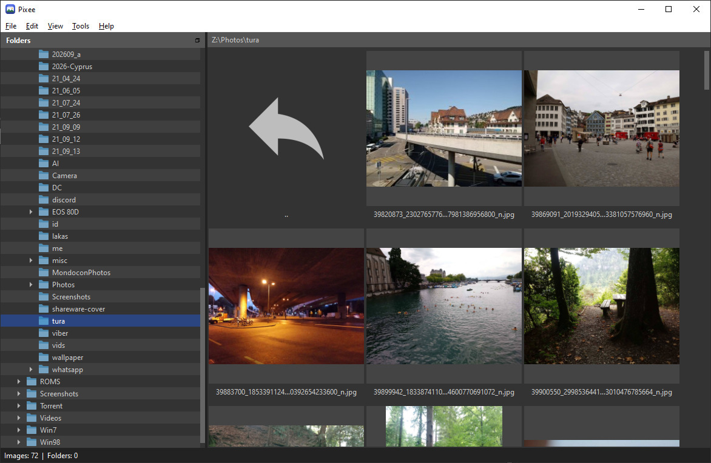
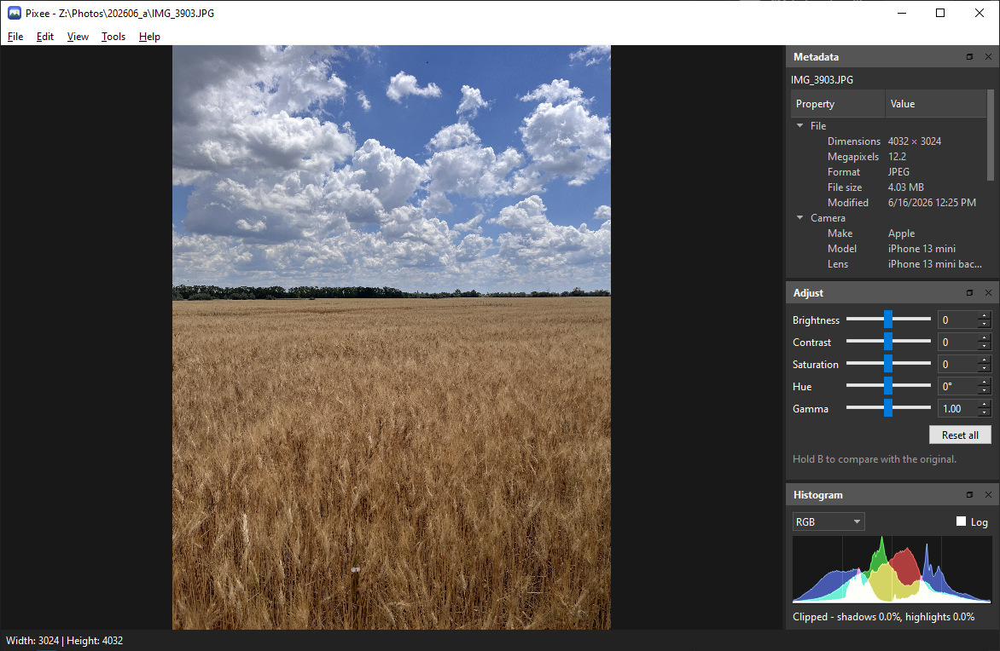
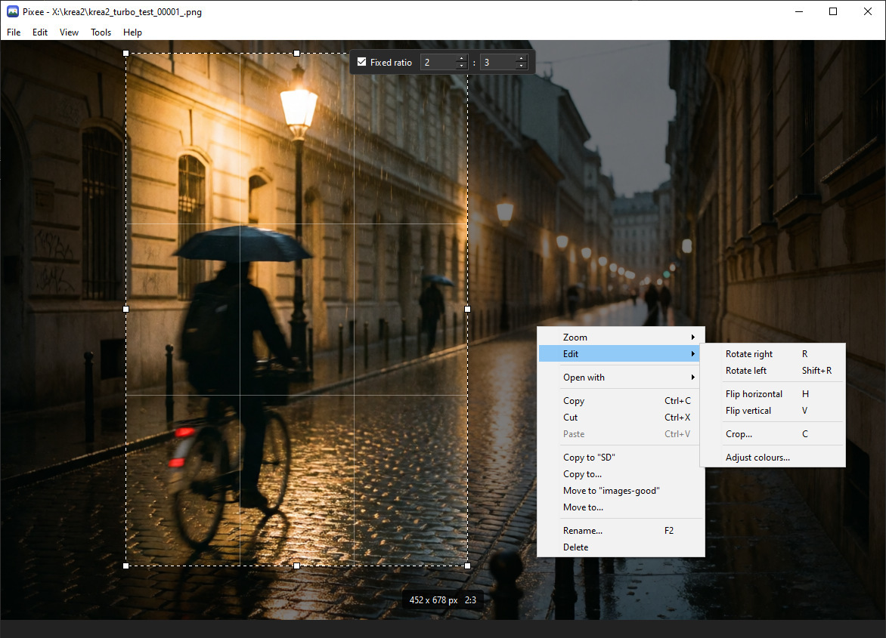
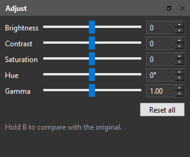
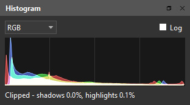
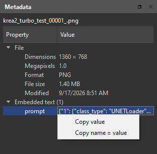
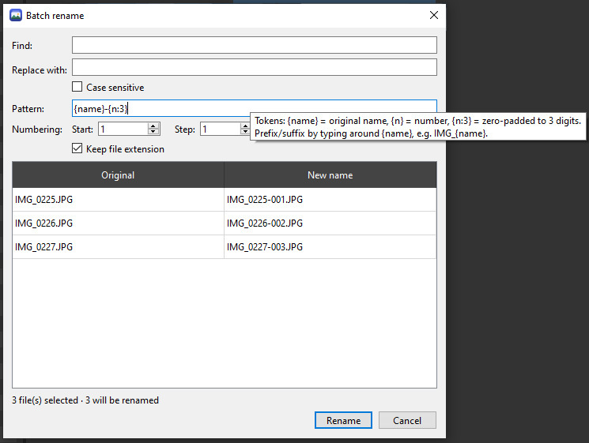
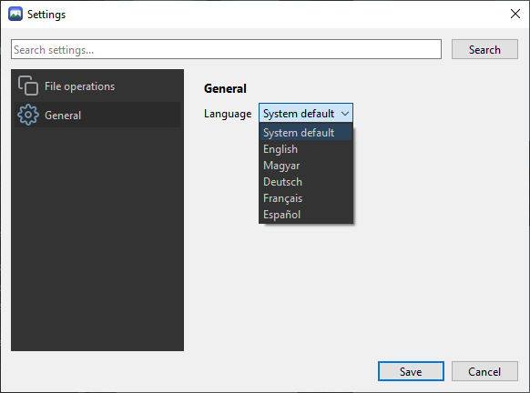

<p align="center">
  
</p>

<h1 align="center">Pixee</h1>

<p align="center">A responsive, minimalist image manager built on Qt 6.</p>

<p align="center"><a href="https://pixee.dynart.net"><strong>pixee.dynart.net</strong></a></p>

<p align="center">
  
  
  
  
</p>

<p align="center">
  <br>
  <em>List view</em>
</p>

## ⬇️ Download

**Windows** — [**Installer** (`Pixee-0.3.0-setup.exe`)](https://github.com/DynartInteractive/Pixee/releases/download/v0.3.0/Pixee-0.3.0-setup.exe) · [**Portable** (`Pixee-0.3.0-portable.zip`)](https://github.com/DynartInteractive/Pixee/releases/download/v0.3.0/Pixee-0.3.0-portable.zip)

The installer registers Pixee in Explorer's **Open with…**; the portable is a self-contained folder — unzip and run `Pixee.exe`. Both are **unsigned** for now, so SmartScreen warns on first run (*More info → Run anyway*). These are still the 0.3.0 builds — 0.4.0 is a Linux packaging release and changes nothing on Windows beyond adding a window icon.

**Linux** — no prebuilt binaries yet, but you can [build a Flatpak](#linux-flatpak) in two commands, or [build from source](#-building) (it's quick with Qt 6.6+). Pixee is **not on Flathub yet**; [`docs/flathub-requirements.md`](docs/flathub-requirements.md) tracks what's left.

**macOS** — no prebuilt binaries; [build from source](#-building).

See [all releases](https://github.com/DynartInteractive/Pixee/releases) for other versions.

## ✨ Features

- **Folder browsing** — multi-drive root, async directory enumeration off the GUI thread, `..` always first. On Linux and macOS the lone `/` row is hidden: the tree starts at the contents of `/` and Pixee opens in your home folder unless a previous session or a command-line image says otherwise; `/media`, `/mnt` and `/Volumes` stay reachable by browsing. Entering a folder re-scans it in the background, so another app's changes show up without a manual `F5`.
- **Path bar completion** — start typing a path and the sub-folders of the directory you are in drop down as full paths. `Up`/`Down` walk them (your typed text is left alone), `Enter` descends into the highlighted folder and immediately offers *its* children, so you can walk a deep tree on the keyboard alone; `Esc` closes the list and `Enter` then navigates as before. Matching is case-insensitive on the last segment only, and the listing is read off the GUI thread and cached per directory — one read per level, not one per keystroke, which is what keeps it usable on a network share.
- **Thumbnail pipeline** — local SQLite cache, four-worker decode pool, viewport-driven priority queue (top-left → bottom-right), per-session negative caching, and background fill of the rest of the folder once the visible cells are done. **Refresh thumbnail** in the context menu rebuilds one from the file's current bytes — the escape hatch for a thumbnail cached from a file that was still being written (a long export). Works on folders too, rebuilding their index overlay.
- **Folder index thumbnails** — the alphabetically-first image inside a folder is overlaid on its folder icon, with a configurable margin / border / vertical offset. The pick uses the file list's own locale-aware, case-insensitive ordering, so the overlay always matches the folder's first cell — and stays alphabetical however the list itself is sorted.
- **Sorting** — `View → Sort by` orders the list by name, creation date or modification date, ascending or descending (two independent, sticky choices). `..` stays first and folders stay grouped ahead of files in A→Z order; the key and direction apply to files only. The folder tree and the index overlay are always name-sorted.
- **Image viewer** in the main window — async chunked loading with a cached-thumbnail placeholder, fit / 1:1 / discrete zoom (`0.1×` – `8×`), pan with `Space + LMB` or `Middle-drag`, `F11` fullscreen, and a 5-image preload cache for instant prev/next.

  <p align="center">
    <br>
    <em>Image view with Metadata, Adjust and Histogram docks</em>
  </p>

- **In-viewer editing** — rotate (`R` / `Shift + R`), flip (`H` / `V`) and **crop** (`C`), from the keys or the viewer's `Edit ▸` menu. The crop marquee has a marching-ants border, eight drag handles, a draggable interior that slides the whole selection, a live pixel-size readout and an optional **fixed aspect ratio** — tick *Fixed ratio* and set the two numbers, e.g. `2 : 3`. `Enter` applies, `Esc` cancels. Edits stay in memory until `File → Save` (`Ctrl + S`) writes them back over the original or `File → Save As…` exports a copy; navigating away with an unsaved edit prompts Save / Discard / Cancel. (Rotate re-encodes the pixels for now — lossless orientation-only rotation comes with metadata write support.)

  <p align="center">
    <br>
    <em>Cropping at a fixed 2 : 3 ratio, with the viewer's <code>Edit ▸</code> menu open</em>
  </p>

- **Colour adjustment** (`View → Adjust`, or `Edit ▸ Adjust colours…` in the viewer) — live **brightness, contrast, saturation, hue and gamma** sliders, applied to the image as you drag. They are stored as parameters rather than baked pixels, so a slider never compounds on its own last value, dragging back to zero restores the original exactly, and the settings survive a rotation. The drag previews on a screen-resolution proxy — responsive even on a 24 MP file — and the full-resolution pass happens once, when you save. Double-click a slider's label to reset that one, **Reset all** for the lot, hold `B` to compare with the original. Viewer-only: it greys out while you are browsing. Adjustments count as an unsaved edit.

  <p align="center">
    <br>
    <em>The Adjust dock</em>
  </p>

- **Histogram** (`View → Histogram`) — a live tone distribution: RGB (additively blended, so overlaps read as the colour they actually make) or luminance, an optional **log scale**, and a **clipping readout** for each end. In the viewer it reads the *same* pixels being painted, so it follows every slider drag rather than lagging a step behind, and panning or zooming never reshapes it. While browsing it follows the file list: one image selected reads that file off-thread, several or none empties it rather than leaving a stale graph up.

  <p align="center">
    <br>
    <em>The Histogram dock</em>
  </p>

- **Metadata panel** (`View → Metadata`) — a read-only info dock for the focused image, whether that's the viewer's or a selected thumbnail. Reads off-thread, so it never stalls browsing on a network share. Shows dimensions / format / size plus any **embedded PNG text** — including AI-tool generation data (ComfyUI `prompt`/`workflow`, Automatic1111 `parameters`) — out of the box; the optional [Exiv2](https://exiv2.org/) backend adds full **EXIF / IPTC / XMP**: camera, exposure, date taken, GPS and a complete tag dump. Right-click or `Ctrl + C` copies a value. See [`docs/metadata.md`](docs/metadata.md) to enable Exiv2.

  <p align="center">
    <br>
    <em>The Metadata dock — right-click a row to copy the full value</em>
  </p>

- **Format support** for everything Qt's image plugins can decode — JPEG, PNG, WebP, GIF, BMP, ICO, plus whatever extra plugins (HEIC, AVIF, PSD via [`kimageformats`](https://invent.kde.org/frameworks/kimageformats), …) are installed against your Qt build. ICO files pick the highest-area, highest-bit-depth sub-image. Windows MSVC recipe: [`docs/windows-extra-image-formats.md`](docs/windows-extra-image-formats.md).
- **Pixel-art aware** — nearest-neighbor upscaling for images smaller than the cell, smooth scaling down. Transparent images render over a configurable checker pattern.
- **SMB-friendly** — chunked reads with cooperative abort, off-GUI enumeration, no `QFileSystemModel` / `QFileDialog`. Built for image folders sitting on a network share.
- **File operations** — Copy / Cut / Paste / Move / Rename / Delete / New folder through a task pipeline. The conflict prompt shows the two clashing files **side by side** — Existing vs Incoming, each with a thumbnail and dimensions / size / date — so you pick Skip / Rename / Overwrite by eye rather than by path. Moves and renames **keep the cached thumbnail** (the row is repointed, not regenerated), and a finished batch selects the files it added and scrolls them into view (toggle in Settings).
- **Batch rename** (`Tools → Batch rename…`) — renames the whole selection at once: find & replace (optionally case-sensitive), a `{name}` / `{n}` pattern with a configurable Start / Step (`{n:3}` zero-pads to three digits; prefix and suffix fall out of typing around `{name}`), and keep-extension. A live before→after table previews every name and flags clashes — two files heading for the same name is blocked, a name that already exists on disk prompts per file. Same task pipeline, so the same progress dock and conflict handling.

  <p align="center">
    <br>
    <em>Batch rename, with the pattern tooltip listing the tokens</em>
  </p>

- **Open with** — right-click an image and hand it to an external editor. The list is yours to build: *Open with → Configure…* has **Add**, **Edit** and **Remove**, and Add/Edit share one dialog — a display label, the path to the executable with a **Browse…** picker, and Save / Cancel. Save stays greyed out until both fields are usable, with the reason shown inline; a bare command name is accepted on purpose (`gimp` gets resolved against `PATH`). The whole selection is passed as arguments, so one launch opens them all. Inside the Flatpak this collapses to a single *Open with…* that routes through the desktop portal — the sandbox can't run host binaries.
- **Save / Save As** (`File → Save`, `Ctrl + S` / `File → Save As…`, `Ctrl + Shift + S`) — write the focused image (the viewer's, or a single selected thumbnail) to any folder, name and format. The format list offers only what your Qt build can actually **write**, with a quality slider for the lossy ones (JPEG / WebP). With an unsaved edit, Save overwrites the original after a confirm and Save As exports the edited pixels; with no edit, Save As converts straight from the file on disk. Both run through the task pipeline, so the side-by-side conflict prompt covers them.
- **Settings window** (`Edit → Settings…`) — a non-modal, always-on-top panel: type to filter any label, groups in an icon sidebar, Save / Cancel. Currently *Select added files* and *Language*.

  <p align="center">
    <br>
    <em>Settings, with the language list open</em>
  </p>

- **Languages** — English plus Hungarian / German / French / Spanish scaffolding; pick one in Settings (restart to apply) or follow the OS locale. Untranslated strings fall back to English.
- **Themable** — Qt stylesheet (`style.qss`) plus an INI for non-CSS values (`style.ini`). User overrides drop in at `<data dir>/themes/<name>/` (see [Theming](#-theming)). Dark theme included.

## 🛠️ Building

### Debian and derivatives (Debian 13 Trixie, Ubuntu 24.04+, Linux Mint 22+)

```sh
sudo apt install build-essential qt6-base-dev qt6-base-dev-tools qt6-l10n-tools
qmake6 Pixee.pro
make
./Pixee
```

Qt only builds in PNG, BMP, GIF, ICO and JPEG support. For **WebP** — plus TIFF, TGA,
WBMP, MNG and ICNS — install the extra plugin pack:

```sh
sudo apt install qt6-image-formats-plugins
```

No rebuild is needed: Pixee derives its extension list from
`QImageReader::supportedImageFormats()` at startup, so restarting the app is enough.
The `Supported image formats:` line it logs on launch tells you what was picked up.

**AVIF** has no Qt 6 package in Debian or Ubuntu (`qt5-avif-image-plugin` and
`kimageformat-plugins` are both Qt 5, so a Qt 6 build will not load them). Build
[`qt-avif-image-plugin`](https://github.com/novomesk/qt-avif-image-plugin) instead —
it ships a qmake project, so no CMake or KDE build tooling is required:

```sh
sudo apt install libavif-dev
git clone --depth 1 https://github.com/novomesk/qt-avif-image-plugin.git
cd qt-avif-image-plugin
qmake6 qt-avif-image-plugin.pro && make
sudo make install
```

Invoke `qmake6` directly as shown — the bundled `build_libqavif_dynamic.sh` looks for
`qmake` / `qmake5` and fails where the Qt 6 binary is named `qmake6`. `make install`
writes `libqavif.so` into the same system `qt6/plugins/imageformats` directory apt uses.

### Other platforms

With Qt 6.6+ and qmake installed:

```sh
qmake Pixee.pro
make            # nmake / mingw32-make on Windows
./Pixee
```

The build copies the `themes/` directory next to the executable on every build, so the dark theme works out of the box.

### Windows: portable & installer

Build with the **MSVC 2022 64-bit** Qt kit (not MinGW), from an **x64 Native Tools Command Prompt for VS** — so `nmake`/`cl` are on `PATH` and the VC++ runtime gets bundled:

```cmd
:: self-contained folder + zip
scripts\make-portable.bat C:\Qt\6.11.1\msvc2022_64

:: the above, then wrapped into dist\Pixee-<ver>-setup.exe (needs Inno Setup 6)
scripts\build-installer.bat
```

The installer registers Pixee in Explorer's **Open with…** for the image types it bundles. It's currently **unsigned**, so SmartScreen warns on first run (*More info → Run anyway*). See [`docs/installer.md`](docs/installer.md) for the association details and how to add Azure code-signing.

Both the app `.exe` and `setup.exe` carry the app icon, generated from the same SVG as the Linux hicolor icon. The `.ico` is checked in at [`resources/icons/Pixee.ico`](resources/icons/Pixee.ico) so a build needs no image tooling — after editing `resources/icons/net.dynart.Pixee.svg`, regenerate and commit it with `scripts\make-icon.bat` (needs ImageMagick 7 with the librsvg delegate).

### Linux: portable

```sh
scripts/make-portable.sh            # --help for options
```

Produces the self-contained `Pixee-portable/` folder plus `Pixee-<ver>-portable.tar.gz`. There is no `windeployqt` on Linux, so the script does the deploy itself: it walks the binary's shared-library dependencies, bundles everything that isn't part of a base Linux system into `lib/`, copies the Qt plugins the app actually uses into `plugins/` (image formats, the SQLite driver behind the thumbnail cache, the xcb/wayland platform plugins), and repeats the walk over those plugins.

Run it with either `./Pixee` (the binary carries an `$ORIGIN/lib` RPATH) or `./Pixee.sh` (a launcher that sets `LD_LIBRARY_PATH`/`QT_PLUGIN_PATH`). The GL, X11, glib and fontconfig stacks are deliberately **not** bundled — those must come from the host to work with its drivers.

#### Extra image formats (HEIC / AVIF / PSD / XCF / WebP)

Two independent plugin sets, both **MSVC-only** — the kit must be `msvc2022_64`, as these plugins won't load into a MinGW build:

- **HEIC/HEIF, AVIF, PSD, XCF** — prebuilt KDE [kimageformats](https://invent.kde.org/frameworks/kimageformats) plugins are committed in [`thirdparty\imageformats\`](thirdparty/imageformats/README.md). `make-portable.bat` bundles them **automatically** on an MSVC build (plugins → `imageformats\`, codec DLLs → next to `Pixee.exe`). No extra step — just build with the MSVC kit as above.
- **WebP** (plus TIFF, TGA, ICNS, …) — Qt's own *Qt Image Formats* add-on, which is **not installed by default**. Add it once via the Qt Maintenance Tool → *Add or remove components* → **Qt 6.11.1 → MSVC 2022 64-bit → Qt Image Formats**. `windeployqt` then bundles `qwebp.dll` into the portable automatically on the next build.

To regenerate the prebuilt kimageformats plugins from source (e.g. after upgrading Qt), see [`docs/windows-extra-image-formats.md`](docs/windows-extra-image-formats.md).

### Linux: Flatpak

```sh
flatpak install flathub org.kde.Platform//6.11 org.kde.Sdk//6.11 org.flatpak.Builder
flatpak run org.flatpak.Builder --user --install --force-clean build packaging/net.dynart.Pixee.yml
flatpak run net.dynart.Pixee
```

The manifest builds from the working tree, so no tag or commit is needed to try it. Packaging files live in [`packaging/`](packaging/); [`docs/flatpak.md`](docs/flatpak.md) covers what the sandbox changes about the app and the permissions it needs, and [`docs/flathub-requirements.md`](docs/flathub-requirements.md) is the submission checklist. Pixee is **not on Flathub yet**.

## ⌨️ Keyboard

### File browser

| Shortcut | Action |
|---|---|
| `F5` | Refresh current folder |
| `F11` | Toggle fullscreen |
| `Enter` / Double-click | Open folder or image |
| `Ctrl + C` | Copy selection to the clipboard |
| `Ctrl + X` | Cut selection to the clipboard (next paste moves) |
| `Ctrl + V` | Paste into the current folder (or, with the folder tree focused, into the folder selected there) |
| `Del` / `Shift + Del` | Delete the selection to the recycle bin / permanently (with the folder tree focused, deletes the folder selected there and steps up to its parent) |
| `Ctrl + Shift + S` | Save As… (export the selected image) |
| `Ctrl + Q` | Quit |

### Image viewer

| Shortcut | Action |
|---|---|
| `←` / `→` | Previous / next image |
| Mouse wheel | Previous / next image |
| `Ctrl` + Mouse wheel | Zoom in / out |
| `+` / `-` | Zoom in / out |
| `0` / `*` | Toggle fit to window |
| `1` | Actual size (1:1) |
| `Space` + Left-drag | Pan |
| Middle-drag | Pan |
| `R` / `Shift + R` | Rotate right / left |
| `H` / `V` | Flip horizontal / vertical |
| `C` | Crop — drag a rectangle, drag the handles to resize or the inside to move it, then `Enter` to apply / `Esc` to cancel |
| `B` (hold) | Compare with the original — temporarily hides any pending colour adjustment |
| `F11` | Toggle fullscreen |
| `Esc` / `Enter` / Double-click | Return to the file list (prompts if there's an unsaved edit) |
| `Ctrl + C` / `Ctrl + X` / `Ctrl + V` | Copy / Cut / Paste the current image |
| `Ctrl + S` | Save (overwrite the original with the edited image) |
| `Ctrl + Shift + S` | Save As… (export the current image) |
| Right-click | Context menu — `Edit ▸` (rotate / flip / crop / adjust colours), `Zoom ▸`, **Copy to…** |

## 🎨 Theming

Each theme is a folder under `themes/`:

```
themes/dark/
├── icons/         # back / file / folder / image-* placeholders
├── images/        # branch arrows etc.
├── style.qss      # Qt stylesheet
└── style.ini      # extra colours / sizes (checker pattern, index-thumbnail margin, ...)
```

Drop a folder at `<data dir>/themes/<name>/` to override the bundled assets without rebuilding, where `<data dir>` is `~/.local/share/Dynart/Pixee` on Linux and `~/.pixee` on Windows. (Pixee also still reads `~/.pixee/themes/` on Linux, so a theme from an older version keeps working.) Anything missing from the user theme falls through to the embedded defaults.

## 🏗️ Architecture

- **Threads** — GUI for view & model; dedicated workers for the SQLite thumbnail cache, four parallel thumbnail decoders, directory enumeration, and full-res viewer loads. Cross-thread communication is exclusively via Qt signals/slots with queued connections.
- **Cache** — `thumbnails.s3db` in the data dir above (SQLite, WAL). Path-keyed; `mtime + size` validate freshness; PNG storage when the source has an alpha channel, JPEG otherwise; format auto-detected on read.
- **Models** — hand-rolled `QAbstractItemModel` + two `QSortFilterProxyModel` instances drive a `QTreeView` (folder dock) and a `QListView` (icon grid). No `QFileSystemModel`, no `QFileDialog` for the central browser — both behave poorly on Windows network shares.

## 📄 License

[MIT](LICENSE) — © 2024 DynartInteractive.
