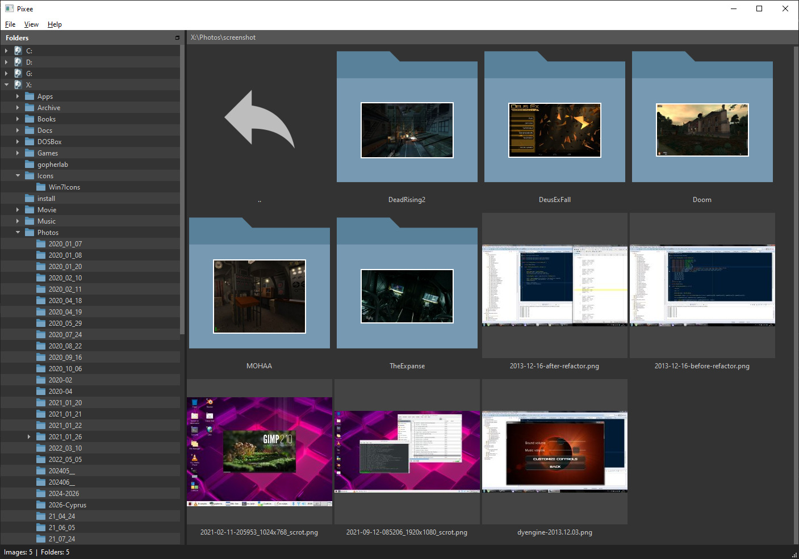

<h1 align="center">📷 Pixee</h1>

<p align="center">A responsive, minimalist image manager built on Qt 6.</p>

<p align="center">
  
  
  
  
</p>



## ⬇️ Download

**Windows** — [**Installer** (`Pixee-0.1.0-setup.exe`)](https://github.com/DynartInteractive/Pixee/releases/download/v0.1.0/Pixee-0.1.0-setup.exe) · [**Portable** (`Pixee-0.1.0-portable.zip`)](https://github.com/DynartInteractive/Pixee/releases/download/v0.1.0/Pixee-0.1.0-portable.zip)

The installer registers Pixee in Explorer's **Open with…**; the portable is a self-contained folder — unzip and run `Pixee.exe`. Both are **unsigned** for now, so SmartScreen warns on first run (*More info → Run anyway*).

**Linux / macOS** — no prebuilt binaries yet; [build from source](#-building) (it's quick with Qt 6.6+).

See [all releases](https://github.com/DynartInteractive/Pixee/releases) for other versions.

## ✨ Features

- **Folder browsing** with multi-drive root, async directory enumeration off the GUI thread, and `..` always sorted first. On Linux and macOS, where there is only ever one drive, the `/` row is hidden — the folder tree starts at the contents of `/` and Pixee opens in your home folder unless a previous session or a command-line image says otherwise. Other volumes (`/media`, `/mnt`, `/Volumes`) stay reachable by browsing. Entering a folder re-scans it in the background (a cheap diff), so files added or removed by another app show up without a manual `F5`.
- **Thumbnail pipeline** — local SQLite cache, four-worker decode pool, viewport-driven priority queue (top-left → bottom-right), per-session negative caching, automatic background fill of the rest of the folder once the visible items are done. A **Refresh thumbnail** context-menu action (for images, and for folders — which rebuild their index-image overlay) force-rebuilds a thumbnail from the file's current bytes — the escape hatch for one cached from a file that was still being written (a long export).
- **Folder index thumbnails** — the alphabetically-first image inside each folder is auto-picked and overlaid on the folder icon, with a configurable margin / border / vertical offset. The pick uses the same locale-aware, case-insensitive ordering as the file list, so the overlay always matches the first cell you see on entering the folder — and it stays alphabetical no matter how the list itself is sorted.
- **Sorting** — `View → Sort by` orders the file list by name, creation date, or modification date, ascending or descending (two independent, sticky choices). Folders stay grouped ahead of files, always sorted alphabetically A→Z (only the files follow the chosen key/direction), and `..` stays first regardless. The folder tree and the folder index overlay are always name-sorted.
- **Image viewer** integrated into the main window: async chunked loading with a cached-thumbnail placeholder, fit / 1:1 / discrete zoom (`0.1×` – `8×`), pan with `Space + LMB` or `Middle-drag`, 90° rotate, `F11` fullscreen, plus a 5-image preload cache for instant prev/next.
- **Metadata panel** (`View → Metadata`) — a read-only info dock for the focused image, updating both as you select thumbnails and as you navigate the viewer. Reads off-thread so it never stalls browsing on a network share. Shows dimensions / format / size and any **embedded PNG text** — including AI-tool generation data (ComfyUI `prompt`/`workflow`, Automatic1111 `parameters`) — out of the box; with the optional [Exiv2](https://exiv2.org/) backend it adds full **EXIF / IPTC / XMP** — camera, exposure, date taken, GPS, and a complete tag dump. Right-click or `Ctrl + C` copies a value (handy for lifting a long prompt). See [`docs/metadata.md`](docs/metadata.md) to enable Exiv2.
- **Format support** for everything Qt's image plugins can decode — JPEG, PNG, WebP, GIF, BMP, ICO, plus whatever extra plugins (HEIC, AVIF, PSD via [`kimageformats`](https://invent.kde.org/frameworks/kimageformats), …) are installed against your Qt build. ICO files pick the highest-area, highest-bit-depth sub-image. See [`docs/windows-extra-image-formats.md`](docs/windows-extra-image-formats.md) for the Windows MSVC setup recipe.
- **Pixel-art aware** — nearest-neighbor upscaling for source images smaller than the cell, smooth scaling for downscaling. Transparent images render over a configurable checker pattern.
- **SMB-friendly** — chunked file reads with cooperative abort, off-GUI directory enumeration, no `QFileSystemModel` / `QFileDialog` for browsing. Designed for image folders sitting on a network share.
- **File operations** — Copy / Cut / Paste / Move / Rename / Delete / New folder, batched through a task pipeline with a modal conflict prompt (Skip / Rename / Overwrite). When a batch finishes, the files it added to the current folder are selected and scrolled into view (toggle in Settings).
- **Settings window** (`Edit → Settings…`) — a non-modal, always-on-top panel: searchable settings (type to filter any label), groups in an icon sidebar, Save / Cancel. Currently: *Select added files* and *Language*.
- **Languages** — English plus Hungarian / German / French / Spanish scaffolding; pick one in Settings (restart to apply) or follow the OS locale. Untranslated strings fall back to English.
- **Themable** — Qt stylesheet (`style.qss`) plus an INI for non-CSS values (`style.ini`). User overrides drop in at `~/.pixee/themes/<name>/`. Dark theme included.

## 🛠️ Building

### Debian 13 (Trixie)

```sh
sudo apt install build-essential qt6-base-dev qt6-base-dev-tools qt6-l10n-tools
qmake6 Pixee.pro
make
./Pixee
```

### Other platforms

With Qt 6.6+ and qmake installed:

```sh
qmake Pixee.pro
make            # nmake / mingw32-make on Windows
./Pixee
```

The build copies the `themes/` directory next to the executable on every build, so the dark theme works out of the box.

### Windows: portable & installer

Build with the **MSVC 2022 64-bit** Qt kit (not MinGW), from an **x64 Native Tools Command Prompt for VS** — so `nmake`/`cl` are on `PATH` and the VC++ runtime gets bundled:

```cmd
:: self-contained folder + zip
scripts\make-portable.bat C:\Qt\6.11.1\msvc2022_64

:: the above, then wrapped into dist\Pixee-<ver>-setup.exe (needs Inno Setup 6)
scripts\build-installer.bat
```

The installer registers Pixee in Explorer's **Open with…** for the image types it bundles. It's currently **unsigned**, so SmartScreen warns on first run (*More info → Run anyway*). See [`docs/installer.md`](docs/installer.md) for the association details and how to add Azure code-signing.

#### Extra image formats (HEIC / AVIF / PSD / XCF / WebP)

Two independent plugin sets, both **MSVC-only** — the kit must be `msvc2022_64`, as these plugins won't load into a MinGW build:

- **HEIC/HEIF, AVIF, PSD, XCF** — prebuilt KDE [kimageformats](https://invent.kde.org/frameworks/kimageformats) plugins are committed in [`thirdparty\imageformats\`](thirdparty/imageformats/README.md). `make-portable.bat` bundles them **automatically** on an MSVC build (plugins → `imageformats\`, codec DLLs → next to `Pixee.exe`). No extra step — just build with the MSVC kit as above.
- **WebP** (plus TIFF, TGA, ICNS, …) — Qt's own *Qt Image Formats* add-on, which is **not installed by default**. Add it once via the Qt Maintenance Tool → *Add or remove components* → **Qt 6.11.1 → MSVC 2022 64-bit → Qt Image Formats**. `windeployqt` then bundles `qwebp.dll` into the portable automatically on the next build.

To regenerate the prebuilt kimageformats plugins from source (e.g. after upgrading Qt), see [`docs/windows-extra-image-formats.md`](docs/windows-extra-image-formats.md).

## ⌨️ Keyboard

### File browser

| Shortcut | Action |
|---|---|
| `F5` | Refresh current folder |
| `F11` | Toggle fullscreen |
| `Enter` / Double-click | Open folder or image |
| `Ctrl + C` | Copy selection to the clipboard |
| `Ctrl + X` | Cut selection to the clipboard (next paste moves) |
| `Ctrl + V` | Paste into the current folder |
| `Ctrl + Q` | Quit |

### Image viewer

| Shortcut | Action |
|---|---|
| `←` / `→` | Previous / next image |
| Mouse wheel | Previous / next image |
| `Ctrl` + Mouse wheel | Zoom in / out |
| `+` / `-` | Zoom in / out |
| `0` / `*` | Toggle fit to window |
| `1` | Actual size (1:1) |
| `Space` + Left-drag | Pan |
| Middle-drag | Pan |
| `F11` | Toggle fullscreen |
| `Esc` / `Enter` / Double-click | Return to the file list |
| `Ctrl + C` / `Ctrl + X` / `Ctrl + V` | Copy / Cut / Paste the current image |
| Right-click | Context menu — rotate left / right, **Copy to…** |

## 🎨 Theming

Each theme is a folder under `themes/`:

```
themes/dark/
├── icons/         # back / file / folder / image-* placeholders
├── images/        # branch arrows etc.
├── style.qss      # Qt stylesheet
└── style.ini      # extra colours / sizes (checker pattern, index-thumbnail margin, ...)
```

Drop a folder at `~/.pixee/themes/<name>/` to override the bundled assets without rebuilding. Anything missing from the user theme falls through to the embedded defaults.

## 🏗️ Architecture

- **Threads** — GUI for view & model; dedicated workers for the SQLite thumbnail cache, four parallel thumbnail decoders, directory enumeration, and full-res viewer loads. Cross-thread communication is exclusively via Qt signals/slots with queued connections.
- **Cache** — `~/.pixee/thumbnails.s3db` (SQLite, WAL). Path-keyed; `mtime + size` validate freshness; PNG storage when the source has an alpha channel, JPEG otherwise; format auto-detected on read.
- **Models** — hand-rolled `QAbstractItemModel` + two `QSortFilterProxyModel` instances drive a `QTreeView` (folder dock) and a `QListView` (icon grid). No `QFileSystemModel`, no `QFileDialog` for the central browser — both behave poorly on Windows network shares.

## 📄 License

[MIT](LICENSE) — © 2024 DynartInteractive.
